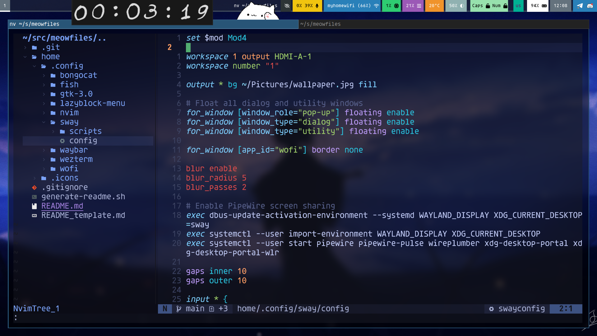
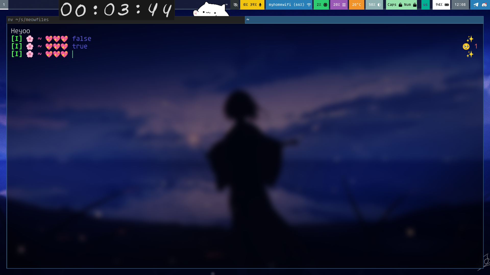
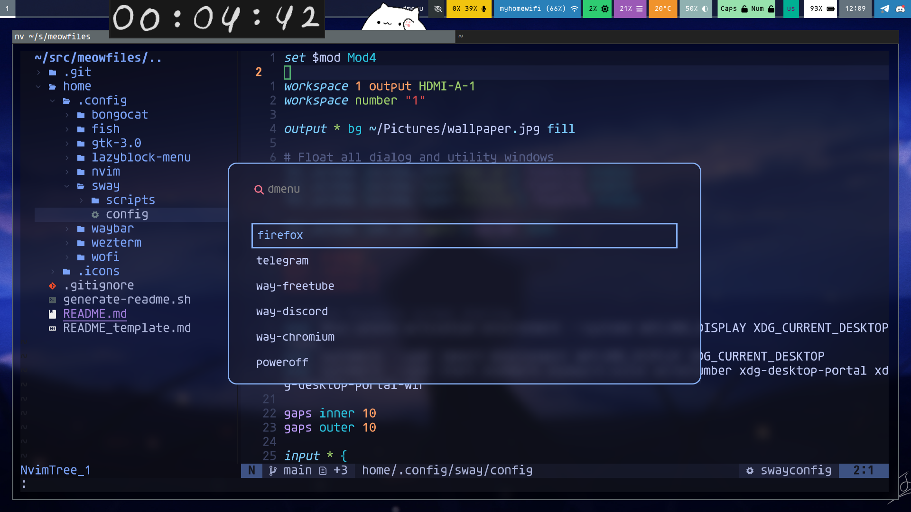

## Preview




## Installation

WARNING: I cannot guarantee you that this config will work on your machine, but if you follow the instructions and install the right versions of software, it should work.

```bash
git clone https://github.com/quanttum1/meowfiles
cd meowfiles/
stow --target=$HOME home
```

## Dependencies

A kind person [@IsThisALis](https://github.com/IsThisALis) wrote [commands to install the dependencies on Arch](./INSTALL_arch.md). Make sure that I ([quanttum1](https://github.com/quanttum1)) use Debian 12 on x86_64, so you might encounter issues if you use other distros

### sway:
- Installation/source: https://github.com/WillPower3309/swayfx
- Version:
```
sway version 0.3.2
```

### wofi:
- Installation/source: `sudo apt install wofi`
- Version:
```
v1.3
```

### wezterm:
- Installation/source: `sudo apt install wezterm`
- Version:
```
wezterm 20240203-110809-5046fc22
```

### fish:
- Installation/source: `sudo apt install fish`
- Version:
```
fish, version 3.6.0
```

### nvim:
- Installation/source: https://github.com/neovim/neovim/releases/download/v0.11.2/nvim-linux-x86_64.appimage
- Version:
```
NVIM v0.11.2
Build type: Release
LuaJIT 2.1.1741730670
Run "nvim -V1 -v" for more info
```

### waybar:
- Installation/source: `sudo apt install waybar`
- Version:
```
Waybar v0.9.17
```

### bongocat:
- Installation/source: https://github.com/saatvik333/wayland-bongocat/releases/download/v1.2.4/bongocat
- Version:
```
[2026-05-09 16:25:43.549] INFO: Starting Bongo Cat Overlay v1.2.4
Bongo Cat Overlay v1.2.4
Built with fast optimizations
```

Run `bash generate-readme.sh` whenever you update any of them
